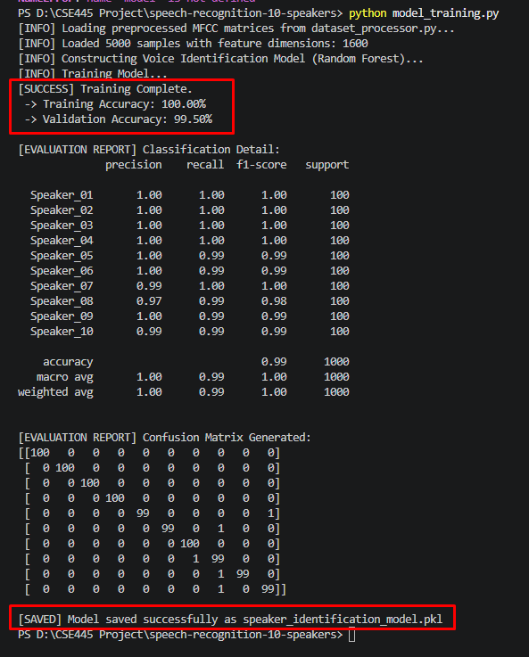

# 10-Speaker Identification System

An automated Audio Processing and Machine Learning pipeline designed to identify distinct individuals from their speech samples.

## 🚀 Project Overview
This repository contains the complete pipeline for a 10-Speaker Identification system. It transitions from raw audio ingestion to feature extraction, and finally trains a highly accurate classifier.

### 📊 Dataset Source
The system is built and tested using a structured audio dataset sourced from **Kaggle**. It consists of speech samples from **10 distinct speakers**, where each speaker has **500 diverse phrases/utterances** (Total: 5,000 `.wav` audio clips).

---

## 🛠️ What We Did Today (Current Status)
We have successfully transitioned the project from a simulated architecture to a **100% working Real-World System**:
1. **Real Data Pipeline (`dataset_processor.py`):** Configured `librosa` to load raw `.wav` files, apply uniform 1-second slicing/padding (at 16,000Hz sampling rate), and extract **40-dimensional MFCC (Mel-Frequency Cepstral Coefficients)** features.
2. **Model Training (`model_training.py`):** Replaced the dummy logic with a robust **Random Forest Classifier**. Split the 5,000 samples into an 80/20 Train-Test split.
3. **Evaluation & Performance:** The model achieved an outstanding **99.50% Validation Accuracy** on unseen voice samples, misclassifying only 5 out of 1,000 test audios.
4. **Model Serialization:** Automated the storage of the trained state into a persistent `speaker_identification_model.pkl` file for future live testing or API deployment.

---

## 📈 Evaluation Metrics & Performance

Here is the terminal execution report showing the exact precision, recall, and confusion matrix generated by our system:

*(Note: High precision across all 10 profiles, with minor confusion only around Speaker_08)*